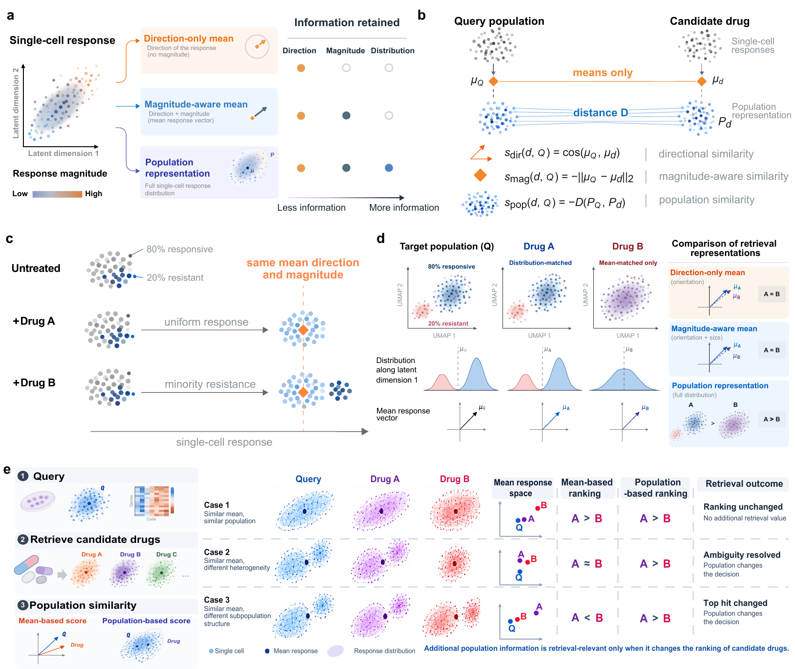

<div align="center">

# When do single-cell response distributions improve drug retrieval?

### PopRetrieve: Population-response retrieval for single-cell perturbation data

<p>
  
  
  
  <a href="LICENSE"></a>
  <a href="manuscript/PopRetrieve_manuscript.pdf"></a>
  <a href="https://huggingface.co/datasets/Boom5426/PopRetrieve"></a>
</p>

<p><strong>A framework for testing when population response structure changes intervention ranking.</strong></p>

<p>
  <a href="#-installation">🚀 Install</a> ·
  <a href="#-data">🤗 Data</a> ·
  <a href="#-reproducing-released-experiments">🧪 Reproduce</a> ·
  <a href="manuscript/PopRetrieve_manuscript.pdf">📄 Paper</a> ·
  <a href="CITATION.cff">📚 Cite</a>
</p>

</div>

<p align="center">
  
</p>

## ✨ Overview

PopRetrieve asks when cell-population response structure improves intervention retrieval beyond what is already available from mean responses. It provides population-retrieval metrics, mean baselines, controlled benchmarks and experiment drivers used in the accompanying manuscript.

The central comparison is a representation ladder: direction-only mean cosine, magnitude-aware mean L2 and population-level scores (energy distance, MMD, sliced Wasserstein and subpopulation coverage). The paper separates gains due to response magnitude from gains that require the full cellular response population.

Across the settings examined, population information matters only when it changes candidate ordering beyond magnitude-aware means and survives forward prediction. The remaining advantage weakens under biological and functional evaluation; the same held-out protein measurements can also favour different fixed RNA rankings when evaluated as mean responses or as full response populations.

<table>
  <tr>
    <td align="center" width="33%"><strong>📐 Scoring ladder</strong><br><sub>Direction, magnitude and population-response retrieval.</sub></td>
    <td align="center" width="33%"><strong>🧬 Evaluation ladder</strong><br><sub>Response matching, biological and functional evaluation, then prediction.</sub></td>
    <td align="center" width="33%"><strong>🔁 Reproducibility</strong><br><sub>Fixed configs, scripts, checked output snapshots and current PDFs.</sub></td>
  </tr>
</table>

## 🚀 Installation

```bash
git clone https://github.com/Boom5426/PopRetrieve.git
cd PopRetrieve

python -m venv .venv
source .venv/bin/activate
python -m pip install --upgrade pip
python -m pip install -e .
```

The public API is available from `popretrieve.metrics`:

```python
from popretrieve.metrics import score_energy, score_mean_cosine

energy_score = score_energy(candidate_cells, query_cells, max_cells=500, seed=7)
mean_score = score_mean_cosine(candidate_cells, query_cells)
```

Energy and MMD use the unbiased U-statistic by default. Set `POPRETRIEVE_ESTIMATOR=v` only when reproducing explicitly labelled legacy V-statistic outputs.

## 🤗 Data

The processed datasets are hosted at [Hugging Face](https://huggingface.co/datasets/Boom5426/PopRetrieve). Download them with Git LFS and point PopRetrieve to the clone:

```bash
git lfs install
git clone https://huggingface.co/datasets/Boom5426/PopRetrieve popretrieve-data
export DIDR_DATA_ROOT="$PWD/popretrieve-data"
```

The release contains the three core processed matrices and the directly used annotation tables. CIGS-derived optional benchmark tables are not redistributed because their source does not state a clear redistribution license. Dataset schemas, provenance, checksums and this boundary are documented in [`DATA.md`](DATA.md) and the Hugging Face data card.

## 🧪 Reproducing released experiments

Run commands from the repository root. Full experiments require the corresponding external datasets.

| Task | Command |
| --- | --- |
| 🧬 Core retrieval experiments | `bash scripts/run_all_core.sh` |
| 📊 Baseline and predict-then-rank experiments | `bash scripts/run_all_baselines.sh` |
| 🧪 Synthetic HIR-Bench | `bash scripts/run_hir_benchmark.sh` |

Set `QUICK=1` for reduced smoke runs. Quick outputs are not the manuscript results.

Selected checked output snapshots are provided under [`results/`](results/). The current manuscript and Supplementary Information are available as [`PopRetrieve_manuscript.pdf`](manuscript/PopRetrieve_manuscript.pdf) and [`PopRetrieve_SI.pdf`](manuscript/PopRetrieve_SI.pdf). See [`results/README.md`](results/README.md) for the scope of those snapshots relative to the current manuscript.

### Current-protocol audits

Two audits added for the current manuscript can be rerun without changing the underlying task definitions. The Fig. 2e audit recomputes the formal full universe from the released per-query table; the Fig. 4 audit recomputes the matched-geometry protein evaluator matrix from the original Frangieh RNA and protein H5AD files.

```bash
# Fig. 2e: full 720-query / 143-drug formal universe
python analysis/audit/fig2e_full_universe_audit.py \
  --per-query results/exp12_partial_observed_retrieval/per_query_scores.csv \
  --out-dir /path/to/new_fig2e_audit

# Fig. 4: requires anndata and scanpy, plus the two Frangieh H5AD files
python -m pip install -e '.[manuscript-audits]'
python analysis/class_c/fig4_matched_geometry_evaluator_audit.py \
  --raw-dir /path/to/frangieh_h5ad_directory \
  --out-dir /path/to/new_fig4_audit
```

The checked outputs are stored in [`results/audit/`](results/audit/). Both commands refuse to overwrite an existing output directory.

## 🗂️ Repository layout

| Path | Contents |
| --- | --- |
| `src/` | Retrieval metrics, baselines, data loaders, benchmarks and experiment drivers |
| `analysis/` | Current-protocol audit scripts for Fig. 2e and Fig. 4 |
| `configs/` | Dataset and experiment configurations |
| `scripts/` | Main reproduction entry points |
| `data/` | Location for external datasets |
| `results/` | Checked output snapshots and compact result summaries |
| `manuscript/` | Current manuscript and Supplementary Information PDFs |

See [`PROJECT_STRUCTURE.md`](PROJECT_STRUCTURE.md) for package details.

## 📚 Citation and license

Citation metadata is provided in [`CITATION.cff`](CITATION.cff). PopRetrieve is released under the MIT License. External datasets retain their original licenses.
